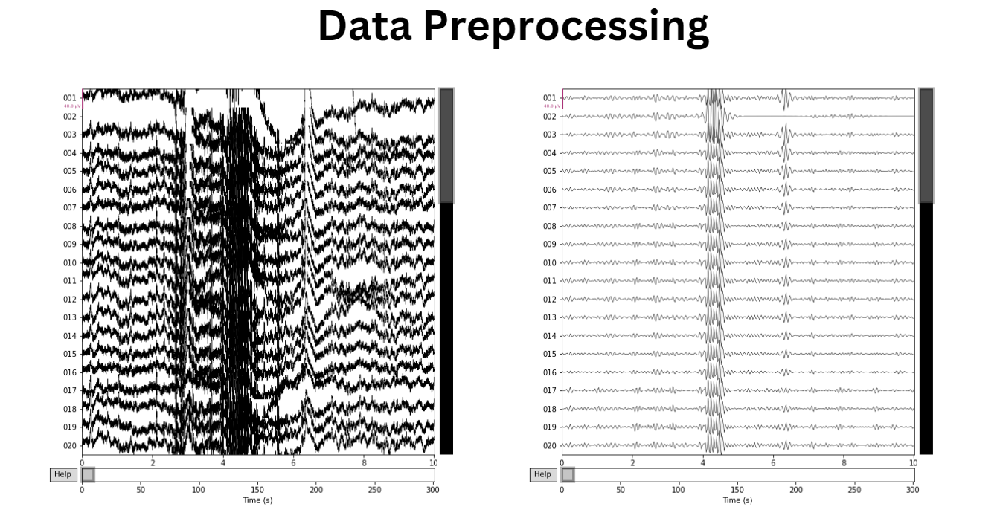

# Psychosis-Detection-using-EEG-Signals

In this project, we worked on analyzing brain signals using an EEG dataset. Our goal is to determine whether the patient has any chance of being diagnosed with Psychosis. The dataset, taken from Mendeley, contains EEG reports of _healthy_ and _First Episode Psychosis_ individuals. We have conducted preprocessing using [MNE Python](https://mne.tools/stable/) package. This project utilises Logistic Regression techniques to train the machine learning model. Through Grid Search Cross-Validation, the model produces the best score of **70%**. 

